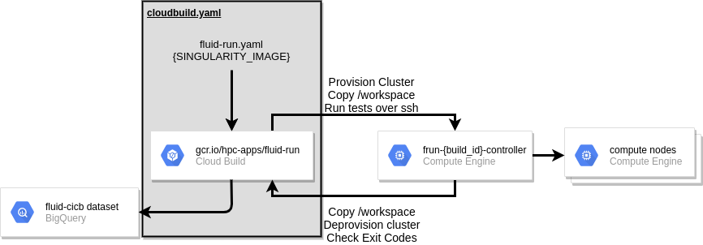

#########################
Architecture Reference
#########################

**********
Overview
**********

RCC Run is a docker image that is meant to be used as a build step in your repository's `Cloud Build <https://cloud.google.com/build>`_ pipeline. Currently, RCC Run accepts only Google Compute Engine VM Images or Singularity Images as build artifacts that can be tested. However, if you currently build Docker images, you can easily create a Singularity image from your Docker image.

***********
Workflow
***********
When fluid-run is called, it will provision an ephemeral Slurm controller for processing tests specified in your :doc:`RCC Run CI YAML <fluid_run_reference>`. Once the controller is provisioned, the local workspace from Cloud Build is copied to the controller and jobs are submitted and tracked by the `cluster-workflow <https://github.com/FluidNumerics/fluid-run/blob/main/bin/cluster-workflow.py>`_ script. 

When each job finishes, this script will align run-time, max memory used, exit code, stdout, stderr, and information about the systems with each execution command is run on. When all jobs are finished, the workspace on the controller is copied back to the Cloud Build workspace. In the last step, the recorded details about your tests are loaded up to Big Query. By default, fluid-run will throw a non-zero exit code if any of your tests show a non-zero exit code; this behavior can be overridden with the `--ignore-exit-code` flag.
